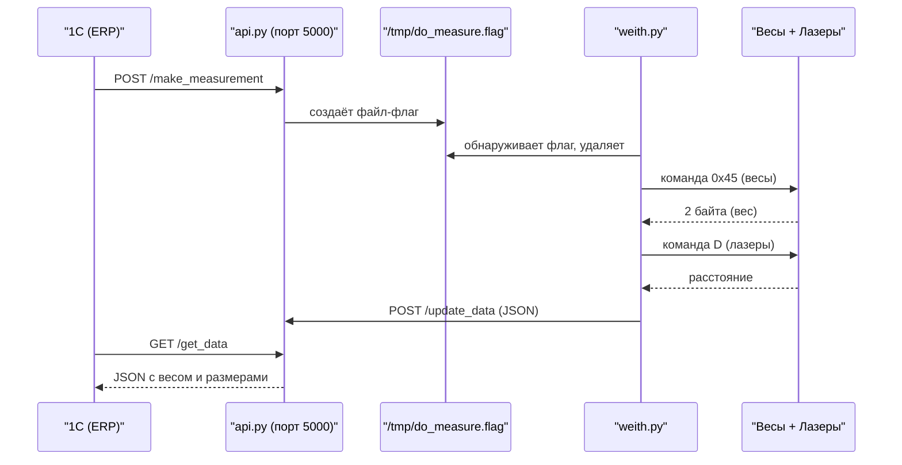

# Инструкция по проекту «scales» (весы + лазеры на Raspberry Pi 3)

## Назначение

Система автоматизирует измерение веса и габаритов коробок для интеграции с 1С. Работает на Raspberry Pi 3 и состоит из 4 сервисов:

| Сервис | Файл | Описание |
|---|---|---|
| `api_service` | `api.py` | Flask API на порту 5000 — принимает запросы от 1С и хранит данные |
| `weith_service` | `weith.py` | Опрос весов и лазерных датчиков через USB-Serial |
| `lcd_display` | `lcd_display.py` | Вывод результатов на LCD 2004 (I2C, адрес 0x27) |
| `key_service` | `key_listener.py` + `usbkey.sh` | Физическая кнопка на GPIO 17 для запуска измерения |

## Структура проекта

```
.
├── install.sh                        # автоматический установщик
├── requirements.txt                  # python-зависимости
├── etc/systemd/system/
│   ├── api_service.service           # Flask API
│   ├── weith_service.service         # цикл измерения
│   ├── lcd_display.service           # LCD-дисплей
│   └── key_service.service           # GPIO-кнопка
└── usr/sbin/wsh/
    ├── api.py                        # Flask API
    ├── weith.py                      # опрос весов и лазеров
    ├── lcd_display.py                # клиент LCD (RPLCD/PCF8574)
    ├── key_listener.py               # слушает кнопку на GPIO 17
    └── usbkey.sh                     # вызывается при нажатии кнопки
```

## Оборудование

- **Raspberry Pi 3**
- **Весы** — подключены через USB-to-Serial (протокол: команда `0x45`, ответ 2 байта little-endian, вес в граммах)
- **3 лазерных датчика** (ID: 058, 095, 086) — USB-to-Serial, baudrate 19200, команды `V` (идентификация) и `D` (измерение расстояния)
- **LCD 2004** — 20×4 символов, I2C, адрес `0x27`, чип PCF8574

## Установка

### 1. Клонирование и запуск

```bash
git clone https://github.com/onepyad/scales.git
cd scales
sudo ./install.sh
```

### 2. Что делает `install.sh`

1. **Системные пакеты**: `python3`, `python3-venv`, `python3-pip`, `python3-smbus`, `i2c-tools`, `curl`
2. **Включает I2C** через `raspi-config nonint do_i2c 0`
3. **Создаёт пользователя** `scales` и добавляет в группы `gpio`, `i2c`, `dialout`
4. **Создаёт каталог** `/usr/sbin/wsh` и копирует туда все скрипты
5. **Создаёт venv** в `/home/scales/venv` и ставит зависимости из `requirements.txt`
6. **Регистрирует 4 systemd-юнита**, делает `daemon-reload`, `enable` и `restart`

### 3. Python-зависимости

```
flask
requests
pyserial
RPLCD
RPi.GPIO
smbus2
```

### 4. Параметры установки (переменные окружения)

| Переменная | По умолчанию | Описание |
|---|---|---|
| `SCALES_USER` | `scales` | системный пользователь |
| `SCALES_HOME` | `/home/$SCALES_USER` | домашний каталог |
| `SCALES_VENV` | `$SCALES_HOME/venv` | путь к venv |
| `SCALES_BIN` | `/usr/sbin/wsh` | куда копируются скрипты |
| `SCALES_SYSTEMD` | `/etc/systemd/system` | каталог systemd-юнитов |

Пример нестандартной установки:
```bash
sudo SCALES_BIN=/opt/scales SCALES_VENV=/opt/scales/venv ./install.sh
```

## Логика работы



Параллельно кнопка на GPIO 17 (`key_listener.py`) при нажатии вызывает `usbkey.sh`, который делает тот же `POST /make_measurement`.

## API-эндпоинты (порт 5000)

### `GET /get_data`
Возвращает последние измеренные данные:
```json
{
  "timestamp": "2025-01-15 14:30:00",
  "weight": 1.234,
  "laser058": 0.305,
  "laser095": 0.21,
  "laser086": 0.155
}
```

### `POST /make_measurement`
Инициирует измерение — создаёт файл `/tmp/do_measure.flag`.

### `POST /update_data`
Внутренний эндпоинт — `weith.py` отправляет сюда результаты измерений. Принимает JSON с полями `timestamp`, `weight` и `laser*`.

### `POST /restart_service`
Перезапускает `weith_service.service` через `systemctl restart`.

## Примеры вызовов

**curl:**
```bash
curl http://<IP>:5000/get_data
curl -X POST http://<IP>:5000/make_measurement
curl -X POST http://<IP>:5000/restart_service
```

**PowerShell:**
```powershell
Invoke-RestMethod -Uri "http://<IP>:5000/get_data"
Invoke-RestMethod -Method Post -Uri "http://<IP>:5000/make_measurement"
```

## Управление сервисами

```bash
sudo systemctl status   api_service
sudo systemctl restart  weith_service
sudo systemctl stop     lcd_display
sudo systemctl start    key_service
```

Все 4 юнита настроены одинаково: `Restart=always`, `RestartSec=5s`, запуск от пользователя `scales`, логи в journal.

## Логи

```bash
sudo journalctl -u api_service.service   -f
sudo journalctl -u weith_service.service -f
sudo journalctl -u lcd_display.service   -f
sudo journalctl -u key_service.service   -f
```

Данные измерений в `weith_service` логируются с уровнем `DATA` — фильтрация:
```bash
sudo journalctl -u weith_service.service -g "DATA"
```

## Как работает измерение (weith.py)

1. **При старте** — сканирует все `/dev/ttyUSB*`, отправляя команду `V` (0x56). Устройства, ответившие `V:...` — лазеры (ID берётся из ответа). Устройство без ответа — весы.
2. **Калибровка лазеров** — при обнаружении лазера сразу запрашивается расстояние командой `D` (0x44). Это расстояние сохраняется как калибровочное (расстояние до противоположной стенки без коробки).
3. **При получении флага** `/tmp/do_measure.flag`:
   - Считывает вес: команда `0x45`, ответ 2 байта (little-endian, бит 15 — знак), переводит в кг (`/ 1000`).
   - Для каждого лазера: команда `D`, вычисляет размер коробки = `калибровочное_расстояние - текущее_расстояние`.
   - Округляет размеры до ближайших 0.005 м (функция `round_to_nearest_5`).
   - Отправляет JSON в API через `POST /update_data`.

## LCD-дисплей (lcd_display.py)

Каждую секунду опрашивает `GET /get_data` и выводит на экран 20×4:

```
Строка 0: timestamp (дата/время)
Строка 1: Massa: <вес>
Строка 2: 058:<значение> 095:<значение>
Строка 3: 086:<значение>
```

Используется библиотека `RPLCD` с чипом `PCF8574`, I2C-адрес `0x27`.

## Кнопка (key_listener.py)

Слушает GPIO 17 (BCM) с подтяжкой к питанию (`PUD_UP`). При замыкании на GND (нажатие) вызывает `usbkey.sh`, который делает `curl -s -X POST` на `/make_measurement`. Защита от дребезга — cooldown 3 секунды.

## Устранение неполадок

| Проблема | Решение |
|---|---|
| Весы не найдены | Проверить подключение USB, `ls /dev/ttyUSB*`, пользователь `scales` в группе `dialout` |
| LCD не работает | `i2cdetect -y 1` — должен показать адрес `0x27`. Проверить I2C: `sudo raspi-config` → Interface → I2C → Enable |
| API не отвечает | `sudo systemctl status api_service`, `journalctl -u api_service -f` |
| Кнопка не срабатывает | `sudo systemctl status key_service`, проверить подключение к GPIO 17 и GND |
| Лазер не определяется | Проверить baudrate 19200, `journalctl -u weith_service -f` |
