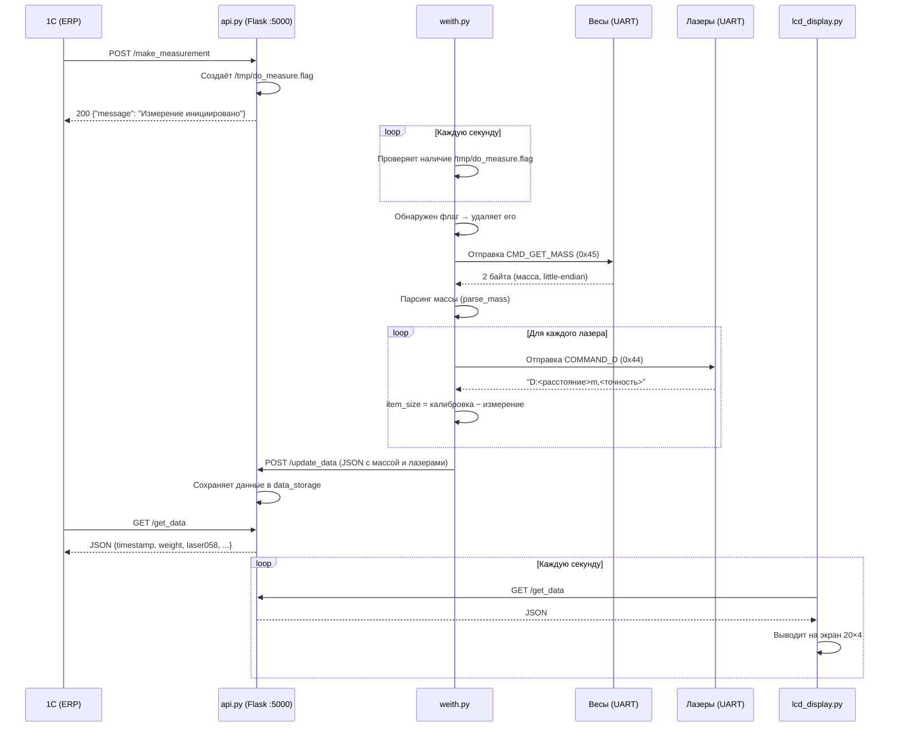

# Инструкция по проекту «scales»

## 1. Назначение проекта

Проект **scales** — это система для автоматизации взвешивания и измерения габаритов на базе **Raspberry Pi 3**.
Система предоставляет REST API (Flask) для интеграции с внешними ERP-системами (например, 1С), управляет весовым модулем и лазерными дальномерами по UART/USB, отображает результаты на LCD-дисплее 20×4 и позволяет запускать измерение физической кнопкой.

Основные возможности:

- Получение массы с весового модуля по серийному протоколу (Space parity, 19200 бод).
- Получение расстояний с нескольких лазерных дальномеров и вычисление размера предмета.
- HTTP API для запуска измерений и получения данных.
- Вывод текущих показаний на LCD 20×4 (I2C, PCF8574).
- Физическая кнопка на GPIO для ручного запуска измерения.
- Автозапуск всех компонентов через systemd.

---

## 2. Структура проекта

```
.
├── install.sh                       # автоматический установщик
├── requirements.txt                 # python-зависимости
├── etc/systemd/system/
│   ├── api_service.service          # Flask API на порту 5000
│   ├── weith_service.service        # цикл измерения весов и лазеров
│   ├── lcd_display.service          # вывод значений на LCD 20×4
│   └── key_service.service          # обработчик GPIO-кнопки
└── usr/sbin/wsh/
    ├── api.py                       # Flask API (4 эндпоинта)
    ├── weith.py                     # опрос весов и лазеров (UART/USB)
    ├── lcd_display.py               # клиент LCD (RPLCD/PCF8574)
    ├── key_listener.py              # слушает кнопку на GPIO 17
    └── usbkey.sh                    # вызывается key_listener при нажатии
```

---

## 3. Оборудование

| Компонент | Описание |
|-----------|----------|
| **Raspberry Pi 3** | Основной контроллер |
| **Весовой модуль** | Подключается по USB/UART. Протокол: 19200 бод, 8 бит данных, Space parity, 1 стоп-бит. Команда запроса массы — `0x45`, ответ — 2 байта (little-endian, бит 15 — знак, биты 0–14 — масса в граммах) |
| **Лазерные дальномеры** | До нескольких штук, подключаются по USB/UART (19200 бод). Идентифицируются по 3-значному ID (например, `laser058`, `laser095`, `laser086`). Команды: `V` (`0x56`) — получить версию/ID, `D` (`0x44`) — получить расстояние |
| **LCD 20×4 (LCD2004)** | I2C-дисплей на чипе **PCF8574** (адрес по умолчанию `0x27`). Выводит метку времени, массу и показания лазеров |
| **Кнопка** | Подключена к **GPIO 17** (BCM). При нажатии вызывается `usbkey.sh`, который делает `POST /make_measurement` |

---

## 4. Установка

### 4.1. Клонирование и запуск

```bash
git clone https://github.com/onepyad/scales.git
cd scales
sudo ./install.sh
```

### 4.2. Что делает `install.sh`

1. **Системные пакеты** — `apt install python3 python3-venv python3-pip python3-smbus i2c-tools curl`.
2. **Включение I2C** — `raspi-config nonint do_i2c 0` (если `raspi-config` доступен).
3. **Создание пользователя** `scales` (без пароля; задайте командой `sudo passwd scales` при необходимости). Добавление в группы `gpio`, `i2c`, `dialout`.
4. **Создание каталога** `/usr/sbin/wsh` для скриптов.
5. **Копирование скриптов** (`api.py`, `weith.py`, `lcd_display.py`, `key_listener.py`, `usbkey.sh`) в `/usr/sbin/wsh` с правами `0755`, владелец — `scales`.
6. **Создание venv** в `/home/scales/venv` и установка зависимостей из `requirements.txt`.
7. **Установка systemd-юнитов** (4 штуки) в `/etc/systemd/system`, затем `daemon-reload`, `enable` и `restart` каждого сервиса.

Скрипт **идемпотентен** — повторный запуск обновит установку без побочных эффектов.

### 4.3. Зависимости (`requirements.txt`)

```
flask
requests
pyserial
RPLCD
RPi.GPIO
smbus2
```

### 4.4. Параметры установки

Настраиваются через переменные окружения:

| Переменная | По умолчанию | Описание |
|---|---|---|
| `SCALES_USER` | `scales` | Системный пользователь |
| `SCALES_HOME` | `/home/$SCALES_USER` | Домашний каталог |
| `SCALES_VENV` | `$SCALES_HOME/venv` | Путь к venv |
| `SCALES_BIN` | `/usr/sbin/wsh` | Куда копируются скрипты |
| `SCALES_SYSTEMD` | `/etc/systemd/system` | Каталог systemd-юнитов |

Пример — установить в `/opt/scales`:

```bash
sudo SCALES_BIN=/opt/scales SCALES_VENV=/opt/scales/venv ./install.sh
```

При нестандартных путях `install.sh` автоматически подменяет пути в `ExecStart` systemd-юнитов.

---

## 5. Логика работы

Взаимодействие системы с 1С и аппаратурой:



Параллельно физическая кнопка на GPIO 17 (через `key_listener.py` → `usbkey.sh`) выполняет тот же `POST /make_measurement`.

---

## 6. API-эндпоинты

API запущен на порту **5000** (Flask). Все ответы — JSON.

### `GET /get_data`

Возвращает последние сохранённые данные измерения.

**Ответ (200):**

```json
{
  "timestamp": "2025-04-28 12:34:56",
  "weight": 1.234,
  "laser058": 0.105,
  "laser095": 0.21,
  "laser086": 0.005
}
```

- `weight` — масса в килограммах (делённая на 1000 от граммов).
- `laser***` — размер предмета в метрах (калиброванное расстояние минус измеренное, округлённое до 0.005 м).

### `POST /make_measurement`

Инициирует новое измерение. Создаёт файл-флаг `/tmp/do_measure.flag`, который отслеживает `weith.py`.

**Ответ (200):**

```json
{
  "message": "Измерение инициировано"
}
```

### `POST /update_data`

Принимает JSON с результатами измерения и сохраняет их в памяти. Вызывается из `weith.py` после опроса датчиков.

**Тело запроса:**

```json
{
  "timestamp": "2025-04-28 12:34:56",
  "weight": 1.234,
  "laser058": 0.105,
  "laser095": 0.21,
  "laser086": 0.005
}
```

**Ответ (200):**

```json
{
  "message": "Данные успешно обновлены"
}
```

**Ответ (400):** если тело пустое.

### `POST /restart_service`

Перезапускает `weith_service.service` через `systemctl restart`.

**Ответ (200):**

```json
{
  "message": "Служба успешно перезапущена",
  "output": ""
}
```

**Ответ (500):** если перезапуск не удался (требуются привилегии `sudo`).

---

## 7. Примеры вызовов

### curl

```bash
# Получить текущие данные
curl http://<PI_IP>:5000/get_data

# Запустить измерение
curl -X POST http://<PI_IP>:5000/make_measurement

# Обновить данные вручную
curl -X POST http://<PI_IP>:5000/update_data \
  -H "Content-Type: application/json" \
  -d '{"timestamp":"2025-04-28 12:00:00","weight":1.5,"laser058":0.1}'

# Перезапустить weith_service
curl -X POST http://<PI_IP>:5000/restart_service
```

### PowerShell

```powershell
# Получить текущие данные
Invoke-RestMethod -Uri "http://<PI_IP>:5000/get_data"

# Запустить измерение
Invoke-RestMethod -Method Post -Uri "http://<PI_IP>:5000/make_measurement"

# Обновить данные вручную
$body = @{timestamp="2025-04-28 12:00:00"; weight=1.5; laser058=0.1} | ConvertTo-Json
Invoke-RestMethod -Method Post -Uri "http://<PI_IP>:5000/update_data" -Body $body -ContentType "application/json"

# Перезапустить weith_service
Invoke-RestMethod -Method Post -Uri "http://<PI_IP>:5000/restart_service"
```

---

## 8. Управление сервисами

В системе зарегистрированы 4 systemd-юнита:

| Юнит | Описание |
|------|----------|
| `api_service.service` | Flask API на порту 5000 |
| `weith_service.service` | Опрос весов и лазеров |
| `lcd_display.service` | Отображение данных на LCD |
| `key_service.service` | Обработка нажатий GPIO-кнопки |

Все юниты имеют единый `[Service]`-блок:

```ini
[Service]
WorkingDirectory=/usr/sbin/wsh
ExecStart=/home/scales/venv/bin/python /usr/sbin/wsh/<script>.py
Restart=always
RestartSec=5s
StandardOutput=journal
StandardError=journal
User=scales
Group=scales
Environment=PYTHONUNBUFFERED=1
```

Основные команды:

```bash
# Статус сервиса
sudo systemctl status api_service.service

# Перезапуск
sudo systemctl restart weith_service.service

# Остановка
sudo systemctl stop lcd_display.service

# Включение/отключение автозапуска
sudo systemctl enable  key_service.service
sudo systemctl disable key_service.service
```

---

## 9. Логи

Все логи пишутся в системный journal (благодаря `StandardOutput=journal` и `StandardError=journal` в юнитах).

```bash
# Просмотр в реальном времени
sudo journalctl -u api_service.service   -f
sudo journalctl -u weith_service.service -f
sudo journalctl -u lcd_display.service   -f
sudo journalctl -u key_service.service   -f

# Последние 50 строк
sudo journalctl -u weith_service.service -n 50

# Логи с определённой даты
sudo journalctl -u api_service.service --since "2025-04-28 10:00:00"
```

### Фильтрация данных измерений

`weith.py` использует кастомный уровень логирования `DATA` (числовое значение 25). Для фильтрации только данных измерений:

```bash
sudo journalctl -u weith_service.service -g "DATA"
```

Ротацией и хранением логов занимается `systemd-journald` (настройки — `/etc/systemd/journald.conf`).

---

## 10. Как работает измерение (`weith.py`)

### 10.1. Запуск и идентификация устройств

При старте `weith.py` вызывает функцию `identify_devices()`:

1. Сканирует все порты `/dev/ttyUSB*`.
2. На каждый порт отправляет команду `V` (`0x56`) — запрос версии лазера.
3. Если ответ начинается с `V:` — это лазер. Из ответа извлекается 3-значный ID (например, `058`), устройство регистрируется как `laser058`.
4. Для каждого найденного лазера сразу запрашивается калибровочное расстояние командой `D` (`0x44`). Ответ формата `D:<расстояние>m,<точность>` парсится, расстояние сохраняется в `calibration_data`.
5. Если порт не ответил на команду `V` — считается, что это **весы**. Первый такой порт сохраняется как `scales`.

### 10.2. Основной цикл

После идентификации `weith.py` входит в бесконечный цикл:

1. **Ожидание флага** — каждую секунду проверяет наличие файла `/tmp/do_measure.flag`.
2. **Обнаружение флага** — удаляет файл, начинает измерение.
3. **Чтение массы** — отправляет команду `0x45` на порт весов (`read_weight`):
   - Очищает входной буфер.
   - Отправляет `CMD_GET_MASS` (`0x45`).
   - Ждёт 2 байта ответа (до 1 секунды).
   - Парсит ответ через `parse_mass()`: little-endian, бит 15 — знак, биты 0–14 — абсолютное значение в граммах.
   - Переводит в килограммы: `weight = mass / 1000.0`.
4. **Чтение лазеров** — для каждого лазера:
   - Отправляет команду `D` (`0x44`).
   - Парсит ответ `D:<расстояние>m,<точность>`.
   - Вычисляет размер предмета: `item_size = calibration_distance − measured_distance`.
   - Округляет до ближайших 0.005 м через `round_to_nearest_5()`.
5. **Отправка данных** — формирует JSON и отправляет `POST /update_data` на локальный API.
6. **Логирование** — данные пишутся с уровнем `DATA` (числовое значение 25) через отдельный логгер `weith_service.data`.

### 10.3. Повторные попытки

Функция `send_command_and_get_response()` отправляет команду с **5 повторными попытками** (по умолчанию). Между попытками — возрастающая задержка (1 с, 2 с, 3 с, ...).

### 10.4. Определение IP

`weith.py` автоматически определяет свой IP-адрес через UDP-сокет к `8.8.8.8:80` (без реального подключения). Этот IP используется для формирования URL API: `http://<LOCAL_IP>:5000/update_data`.

---

## 11. LCD-дисплей (`lcd_display.py`)

LCD-дисплей 20×4 символов (LCD2004) подключается через I2C на чипе **PCF8574** (адрес `0x27`, порт 1). Используется библиотека **RPLCD**.

### Что отображается

| Строка | Содержимое | Пример |
|--------|-----------|--------|
| 1 | Метка времени (`timestamp`) | `2025-04-28 12:34:56` |
| 2 | Масса | `Massa: 1.234` |
| 3 | Лазеры 058 и 095 | `058:0.105 095:0.21` |
| 4 | Лазер 086 | `086:0.005` |

### Логика работы

Каждую **1 секунду** скрипт:

1. Делает `GET /get_data` к API.
2. Извлекает `timestamp`, `weight`, `laser058`, `laser095`, `laser086`.
3. Обновляет 4 строки LCD.
4. Если API недоступен — выводит `API error`.

Значения обрезаются до 6 символов и точка заменяется на запятую для числового формата.

---

## 12. Кнопка (`key_listener.py`)

Физическая кнопка подключена к **GPIO 17** (нумерация BCM) с подтяжкой к питанию (`PUD_UP`). При нажатии (LOW) происходит:

1. **Антидребезг** — повторное срабатывание блокируется на 3 секунды (`COOLDOWN = 3`).
2. Вызывается скрипт `/usr/sbin/wsh/usbkey.sh`.
3. `usbkey.sh` определяет локальный IP и отправляет `curl -s -X POST http://<IP>:5000/make_measurement`.

Таким образом нажатие кнопки запускает ту же цепочку измерений, что и вызов API из 1С.

Опрос состояния кнопки происходит каждые **50 мс** (`time.sleep(0.05)`).

---

## 13. Устранение неполадок

| Проблема | Решение |
|----------|---------|
| Сервис не запускается | `sudo journalctl -u <unit>.service -n 50` — проверить логи |
| Весы не найдены | Убедитесь, что USB-кабель подключён. Проверьте `ls /dev/ttyUSB*`. Убедитесь, что пользователь `scales` в группе `dialout` |
| Лазер не отвечает | Проверьте подключение. Попробуйте `echo -ne '\x56' > /dev/ttyUSBx` вручную. Проверьте baudrate (19200) |
| LCD не работает | Проверьте I2C: `sudo i2cdetect -y 1` — должен показать адрес `0x27`. Убедитесь, что I2C включён: `sudo raspi-config nonint do_i2c 0` |
| API не отвечает | `curl http://localhost:5000/get_data` — проверить доступность. `sudo systemctl status api_service.service` |
| Кнопка не реагирует | Проверьте GPIO 17 подключение. `sudo systemctl status key_service.service`. Убедитесь, что пользователь `scales` в группе `gpio` |
| `Permission denied` на `/dev/ttyUSB*` | `sudo usermod -aG dialout scales && sudo reboot` |
| Ошибка `No module named 'RPi.GPIO'` | Скрипт запускается не из venv. Проверьте `ExecStart` в юните — должен указывать на `/home/scales/venv/bin/python` |
| Данные не обновляются в 1С | Проверьте, что `weith_service` запущен. Проверьте наличие флага: `ls /tmp/do_measure.flag`. Проверьте логи `weith_service` |
| Неверная масса | Проверьте параметры серийного порта (Space parity, 19200, 8N1). Проверьте формат ответа весов (2 байта little-endian) |
